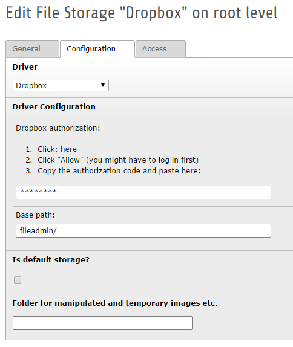
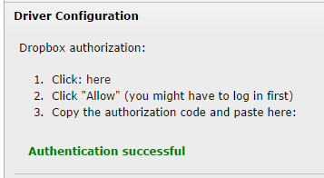

.. ==================================================
.. FOR YOUR INFORMATION
.. --------------------------------------------------
.. -*- coding: utf-8 -*- with BOM.

.. include:: ../Includes.txt

.. _admin-manual:

Administrator Manual
====================

Installation
------------

Add a new file storage with the "Dropbox" driver to root page (pid = 0).

Target group: **Administrators**

Dropbox authentication
----------------------

Follow the instructions (see above) to connect your Dropbox account with TYPO3 CMS:

1. Click on the link
2. Click "Allow" (you might have to log in first)
3. Copy the authorization code and paste to the field

After saving the storage settings, you should see the following success message:

	If you do not see this message, something went wrong.

Base path:
^^^^^^^^^^

The base path is the directory in your Dropbox, which will be used by this driver.
