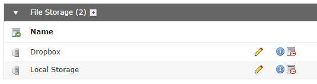

.. ==================================================
.. FOR YOUR INFORMATION
.. --------------------------------------------------
.. -*- coding: utf-8 -*- with BOM.

.. include:: ../Includes.txt

What does it do?
================

This is a driver for the file abstraction layer (FAL) to support Dropbox.

You can create a file storage which allows you to upload/download and link the files to Dropbox. So you can upload your files in the TYPO3 CMS backend to Dropbox and link them in the frontend. Website visitor download the files from paths like \https://dl.dropboxusercontent.com/1/view/iwojriojfiajsdfj/fileadmin/big-file.iso

It also supports the TYPO3 CMS image rendering but it is not recommended because the Dropbox API isn't very fast with processing the files.

Requires TYPO3 CMS 6.2

	Two storages are installed here

